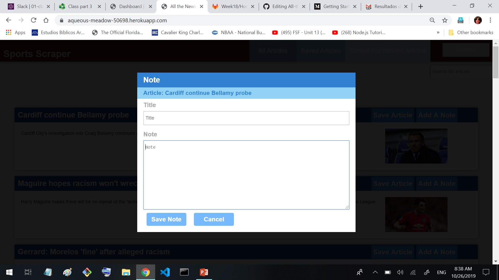

All the News That's Fit to Scrape

Overview

In this assignment, you'll create a web app that lets users view and leave comments on the latest news. But you're not going to actually write any articles; instead, you'll flex your Mongoose and Cheerio muscles to scrape news from another site.

Before You Begin

Create a GitHub repo for this assignment and clone it to your computer. Any name will do -- just make sure it's related to this project in some fashion.

Run npm init. When that's finished, install and save these npm packages:

express
express-handlebars
mongoose
cheerio
axios

NOTE: If you want to earn complete credit for your work, you must use all five of these packages in your assignment.
In order to deploy your project to Heroku, you must set up an mLab provision. mLab is remote MongoDB database that Heroku supports natively. Follow these steps to get it running:
Create a Heroku app in your project directory.
Run this command in your Terminal/Bash window:

heroku addons:create mongolab
This command will add the free mLab provision to your project.

When you go to connect your mongo database to mongoose, do so the following way:

// If deployed, use the deployed database. Otherwise use the local mongoHeadlines database
var MONGODB_URI = process.env.MONGODB_URI || "mongodb://localhost/mongoHeadlines";

mongoose.connect(MONGODB_URI);

This code should connect mongoose to your remote mongolab database if deployed, but otherwise will connect to the local mongoHeadlines database on your computer.

Watch this demo of a possible submission. See the deployed demo application here.
Your site doesn't need to match the demo's style, but feel free to attempt something similar if you'd like. Otherwise, just be creative!

Commits

Having an active and healthy commit history on GitHub is important for your future job search. It is also extremely important for making sure your work is saved in your repository. If something breaks, committing often ensures you are able to go back to a working version of your code.

Committing often is a signal to employers that you are actively working on your code and learning.

We use the mantra “commit early and often.”  This means that when you write code that works, add it and commit it!
Numerous commits allow you to see how your app is progressing and give you a point to revert to if anything goes wrong.

Be clear and descriptive in your commit messaging.

When writing a commit message, avoid vague messages like "fixed." Be descriptive so that you and anyone else looking at your repository knows what happened with each commit.

We would like you to have well over 200 commits by graduation, so commit early and often!

Submission on BCS

This assignment must be deployed. * Please submit both the deployed Heroku link to your homework AND the link to the Github Repository!

Instructions

Create an app that accomplishes the following:

Whenever a user visits your site, the app should scrape stories from a news outlet of your choice and display them for the user. Each scraped article should be saved to your application database. At a minimum, the app should scrape and display the following information for each article:

 * Headline - the title of the article

 * Summary - a short summary of the article

 * URL - the url to the original article

 * Feel free to add more content to your database (photos, bylines, and so on).

Users should also be able to leave comments on the articles displayed and revisit them later. The comments should be saved to the database as well and associated with their articles. Users should also be able to delete comments left on articles. All stored comments should be visible to every user.

Beyond these requirements, be creative and have fun with this!

Tips

Go back to Saturday's activities if you need a refresher on how to partner one model with another.
Whenever you scrape a site for stories, make sure an article isn't already represented in your database before saving it; Do not save any duplicate entries.

Don't just clear out your database and populate it with scraped articles whenever a user accesses your site.

If your app deletes stories every time someone visits, your users won't be able to see any comments except the ones that they post.

Helpful Links

MongoDB Documentation
Mongoose Documentation
Cheerio Documentation

Reminder: Submission on BCS

Please submit both the deployed Heroku link to your homework AND the link to the Github Repository!

Minimum Requirements

This assignment must be deployed. Attempt to complete homework assignment as described in instructions. If unable to complete certain portions, please pseudocode these portions to describe what remains to be completed. Hosting on Heroku and adding a README.md are required for this homework. In addition, add this homework to your portfolio, more information can be found below.

Hosting on Heroku

Now that we have a backend to our applications, we use Heroku for hosting. Please note that while Heroku is free, it will request credit card information if you have more than 5 applications at a time or are adding a database.

Please see Heroku’s Account Verification Information for more details.

